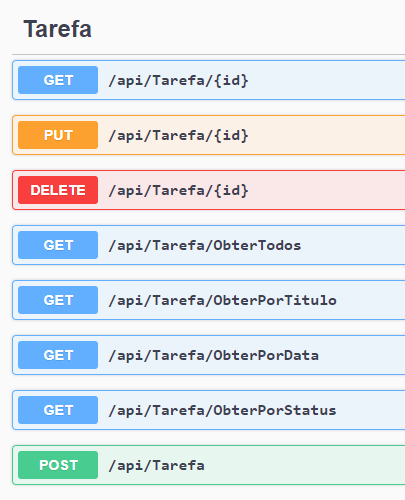

# DIO - Trilha .NET - API e Entity Framework
www.dio.me

## Desafio de projeto
Para este desafio, você precisará usar seus conhecimentos adquiridos no módulo de API e Entity Framework, da trilha .NET da DIO.

## Contexto
Você precisa construir um sistema gerenciador de tarefas, onde você poderá cadastrar uma lista de tarefas que permitirá organizar melhor a sua rotina.

Essa lista de tarefas precisa ter um CRUD, ou seja, deverá permitir a você obter os registros, criar, salvar e deletar esses registros.

A sua aplicação deverá ser do tipo Web API ou MVC, fique a vontade para implementar a solução que achar mais adequado.

## Métodos esperados
É esperado que você crie o seus métodos conforme a seguir:


**Swagger**





**Endpoints**


| Verbo  | Endpoint                | Parâmetro | Body          |
|--------|-------------------------|-----------|---------------|
| GET    | api/Tarefa/{id}            | id        | N/A           |
| PUT    | api/Tarefa/{id}            | id        | Schema Tarefa |
| DELETE | api/Tarefa/{id}            | id        | N/A           |
| GET    | api/Tarefa/ObterTodos      | N/A       | N/A           |
| GET    | api/Tarefa/ObterPorTitulo  | titulo    | N/A           |
| GET    | api/Tarefa/ObterPorData    | data      | N/A           |
| GET    | api/Tarefa/ObterPorStatus  | status    | N/A           |
| POST   | api/Tarefa                 | N/A       | Schema Tarefa |

Esse é o schema (model) de Tarefa, utilizado para passar para os métodos que exigirem

```json
{
  "id": 0,
  "titulo": "string",
  "descricao": "string",
  "data": "2022-06-08T01:31:07.056Z",
  "status": "string"
}
```


## Solução

RESOLVIDO EM 27/10/2023
